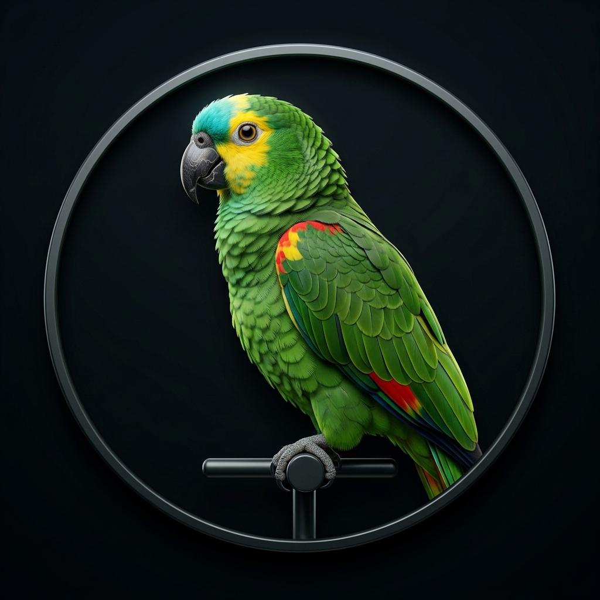

# 🦜 Parrot — Tradutor de Voz em Tempo Real para Chamadas Internacionais

<p align="center">
  
</p>

O **Parrot** é uma aplicação desktop inteligente para macOS projetada para reuniões internacionais (Google Meet, Zoom, Microsoft Teams, Discord, etc.).

Com o Parrot, você pode participar de qualquer chamada falando em **Português**: o sistema transcreve, traduz e sintetiza a sua fala em **Inglês fluente com voz humana**, injetando o áudio diretamente na reunião através de um microfone virtual (`Perssua` / `BlackHole`).

Além disso, o Parrot monitora o que os participantes estrangeiros falam em inglês, fornecendo **legendas em tempo real** em português (em janela ou HUD flutuante) e áudio traduzido nos seus fones de ouvido.

---

## ⚡ Como Funciona a Arquitetura de Áudio

```
 [Você fala em Português] 
           │
           ▼
 [Seu Microfone Físico] (MacBook / Fone)
           │
           ▼
 [Detecção VAD / Push-to-Talk]
           │
           ▼
 [STT: Transcrição em Português]
           │
           ▼
 [Tradução: PT ➔ EN (OpenAI GPT-4o / Google)]
           │
           ▼
 [TTS: Síntese de Voz Humana em Inglês]
           │
           ▼
 [Microfone Virtual Perssua / BlackHole]
           │
           ▼
 [Google Meet / Zoom / Discord / Teams]
    (O gringo ouve você falando em Inglês fluente!)
```

---

## 🚀 Como Iniciar

### 1. Início Rápido com 1 clique:

No terminal, dentro da pasta do projeto:

```bash
./start.sh
```

Ou diretamente via Python:

```bash
source .venv/bin/activate
python3 main.py
```

O Parrot abrirá automaticamente a janela desktop nativa. Você também pode acessar pelo navegador em [http://localhost:8765](http://localhost:8765).

---

## 🎧 Configuração no Google Meet / Zoom / Discord / Teams

Para que as pessoas da reunião ouçam a sua voz traduzida em inglês:

1. Abra as **Configurações de Áudio** do seu aplicativo de chamada (Meet, Zoom, Discord, etc.).
2. No campo **Microfone (Entrada de Áudio)**, selecione:  
   👉 **`Perssua`** (o driver virtual de áudio já instalado e configurado no seu Mac).
3. No campo **Alto-falante (Saída de Áudio)**, mantenha os seus fones de ouvido normais (`Fones de Ouvido Externos` ou fone Bluetooth).
4. No Parrot, clique em **"INICIAR TRADUÇÃO"**.
5. Fale normalmente em português! Quando você terminar a frase, o Parrot falará em inglês para todos na reunião.

---

## 🧠 Motores de IA Disponíveis

O Parrot permite alternar entre dois motores com 1 clique na barra superior:

| Recurso | ⚡ Motor OpenAI (Alta Fidelidade) | 🆓 Motor Gratuito (100% Free) |
| :--- | :--- | :--- |
| **STT (Reconhecimento)** | OpenAI Whisper (`whisper-1`) | Google Speech Recognition |
| **Tradução** | `gpt-4o-mini` (conversacional, gírias e contexto) | Google Translate (`deep-translator`) |
| **TTS (Síntese de Voz)** | OpenAI TTS-1 (`alloy`, `echo`, `nova`, `onyx`, etc.) | Microsoft Edge Neural Voices (`Christopher`, `Jenny`, etc.) |
| **Custo** | Utiliza créditos da sua API Key da OpenAI | R$ 0,00 (Ilimitado e sem custos) |

Sua chave de API da OpenAI já está configurada no arquivo `.env`.

---

## 🖥️ Recursos da Interface

- **Controle Master**: Botão para iniciar/pausar com indicador visual pulsante e medidor de VU do microfone.
- **Modo de Voz**:
  - **Automático (VAD)**: Detecta quando você começa a falar e traduz automaticamente quando detecta uma pausa/silêncio.
  - **Push-to-Talk (PTT)**: Segure a barra de espaço ou o botão no app para falar; solte para disparar a tradução imediatamente.
- **Campo de Fala Rápida por Texto**: Digite uma frase em português e aperte Enter para que o Parrot fale em inglês na reunião sem que você precise falar em voz alta.
- **Simulador de Participante Estrangeiro**: Botões para testar frases em inglês de reuniões reais e verificar a tradução instantânea para português.
- **Legendas HUD Flutuantes**: Clique em **"Legendas HUD"** para abrir uma janela translúcida independente que fica sempre no topo da tela, perfeita para posicionar sobre o Zoom ou Google Meet.
- **Painel de Configurações**: Ajuste dispositivos de entrada/saída, vozes, tempo de pausa do VAD e teste de som.

---

## 🛠️ Tecnologias Utilizadas

- **Frontend**: HTML5, Tailwind CSS, WebSockets e Glassmorphism UI.
- **Desktop Runtime**: `pywebview` com Cocoa WebKit nativo do macOS.
- **Backend**: FastAPI, Uvicorn e AsyncIO.
- **Áudio Core**: `sounddevice`, `soundfile`, `miniaudio`, `numpy`.
- **Drivers Virtuais**: Core Audio HAL Plugin (`Perssua` / Existential Audio BlackHole).
- **IA & TTS**: `openai`, `deep-translator`, `edge-tts`, `SpeechRecognition`.
